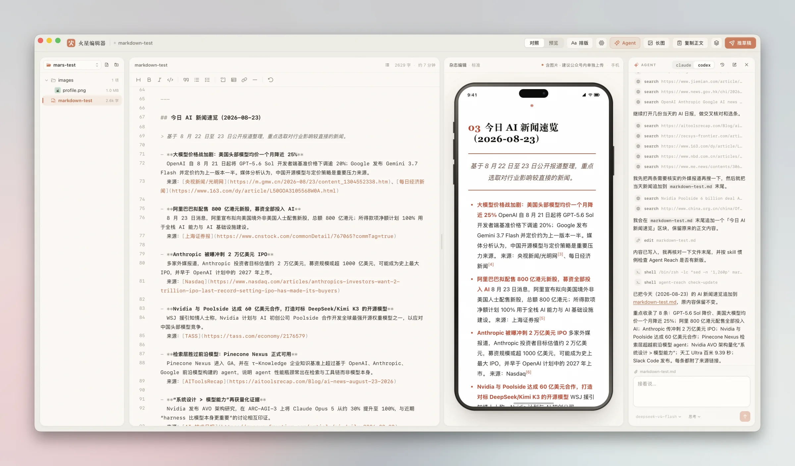

# 空核编辑器 · KonhEditor

Markdown 写作，一键转成公众号排版 —— 粘进公众号编辑器即可无损还原，也可以直接推送到公众号
草稿箱。你在预览里看到的，就是读者手机上的样子。

macOS / Windows / Linux 桌面应用。



## 致谢与项目来源

空核编辑器基于 [whyubel1eve/Mars-Editor-APP](https://github.com/whyubel1eve/Mars-Editor-APP)
（火星编辑器）二次开发，并继续采用 MIT 协议。

首先感谢原作者完成了工作区文件管理、Markdown 排版、公众号预览、图片处理、草稿箱推送、
本地 Claude Code / Codex 集成以及 Tauri 多平台客户端等核心能力。空核编辑器是在这些扎实基础上，
面向「空核域界」内容品牌和不依赖本地终端的使用方式继续定制，不冒充原作，也不抹去上游贡献。

### 与原版火星编辑器的主要区别

| 项目 | 原版火星编辑器 | 空核编辑器 KonhEditor |
| --- | --- | --- |
| 品牌 | 火星编辑器 | 空核编辑器；预览署名为空核域界 |
| 内置主题 | 原版主题库 | 扩展为 23 套，并加入空核域界品牌版式 |
| 主题作用范围 | 一个工作区共用一个主题 | 每篇文章独立记住主题，切换文章自动恢复 |
| 品牌文章组件 | 普通 Markdown 排版 | 空核域界主题支持 front-matter 头图、导语、标签和签名卡 |
| Agent 默认方式 | 调用本机 Claude Code / Codex CLI | 仅使用可配置的 OpenAI 兼容 API Agent，不需要本地终端 |
| Agent 工作权限 | CLI 自己的工具与权限 | API Agent 仅可列出、搜索、读取和写入当前工作区文件，无 Shell 权限 |
| API 配置 | 跟随本地 CLI 配置 | 自定义 Base URL、API Key、模型名，并检测标准工具调用能力 |
| 预览设备 | 按面板宽度自动判断，状态文字不可点击 | 右上角可手动切换手机 / 桌面并记住选择 |
| 应用外观 | 浅色 / 深色 | 默认跟随系统并实时自动切换，也可手动选择 |
| 图标 | 火星编辑器图标 | 简约“笔记页 + 空心核心 + 编辑笔划”品牌图标 |
| 更新来源 | 原作者 GitHub Releases | `hackmgrm/Mars-Editor-APP` 自有 Release、更新公钥和签名体系 |

## 工作区就是一个普通文件夹

草稿不藏在应用里面，就是磁盘上的文件：

```
工作区/
├── 随便怎么放.md    任意层级的 .md / .markdown / .txt，点开就能编辑
├── 系列/
│   └── 第一篇.md
└── images/          粘贴 / 拖入的图默认落在这里，但图放哪一层都认
```

目录结构由你自己定，应用不规定 —— 左侧文件树如实显示文件夹里的东西，新建、改名、删除、
拖拽移动都是直接落到磁盘上的真操作。

## 用 API Agent 直接改稿

在顶栏「设置 → API Agent」填写一个支持标准 Tool Calling 的 OpenAI 兼容接口：

- Base URL，例如 `https://api.openai.com/v1`
- API Key（只保存在本机应用配置目录）
- 模型名（可从接口自动获取并选择；不支持 `/models` 的服务仍可手动填写）

「测试 API」不仅检查能否聊天，还会验证接口是否返回标准 `tool_calls`。测试通过后，它就能列出、
搜索、读取、创建和修改当前工作区里的文本文件；输入框左下角可以直接切换接口返回的模型。API Agent 没有终端和 Shell
权限，绝对路径、`..` 以及任何越出工作区的路径都会被拒绝。

## 功能

- Markdown 实时预览，编辑区与预览区滚动同步
- 23 套内置主题（浅色 / 深色纸底）、三档排版密度；每篇文章可独立选择主题
- 空核域界品牌主题支持 front-matter 自动头图、导语、标签和签名卡
- OpenAI 兼容 API Agent，可直接在当前工作区读写文章，不依赖本地终端
- 编辑器界面自身有浅色 / 深色两套外观，默认跟随系统
- 公众号预览可手动切换手机 / 桌面并记住选择
- 一键复制为公众号可用的富文本
- 图片拖拽 / 粘贴上传，落到工作区 `images/`
- 代码高亮、脚注、`==高亮==` 等扩展语法
- 外链自动转文末脚注（公众号正文点不动外链）
- 复制时自动把外链图内嵌，绕开图床防盗链
- 从链接导入：任意网页转成 Markdown 草稿，图片一并落到工作区
- 一键推送到公众号草稿箱，正文图片自动上传微信素材
- 正文长图 `.png` 导出，走系统「存储到…」对话框

## 从链接导入

网址复制好，点左侧文件树顶上的地球图标（或者在文件夹上右键「从链接导入」），链接已经替你填好了 ——
剪贴板里是网址就自动带进来，不用再粘一次，直接回车。

出来的是一篇 Markdown 草稿：只要正文，导航栏、侧边栏、推荐位、评论区都不跟着进来。默认「把图片
一并存进工作区」—— 图落到 `images/` 就成了本地文件，之后复制、导长图、推草稿都不用再看对方图床
的脸色。

**公众号文章走本地**：`mp.weixin.qq.com` 的链接由这台电脑直接去微信取，网址不发给任何人。
公众号对第三方抓取服务一律弹「环境异常」验证页，所以这类链接本来也只能这么走；好在正文容器
（`#js_content`）是固定的，不需要猜哪块是正文。

**其他网页走 Jina Reader**：正文提取交给 `r.jina.ai` —— 判断整个 DOM 里哪一块是正文，还要能跑
JavaScript 渲染的页面，这两件事塞不进一个桌面编辑器。代价说明白：**你要导入的网址会发给它**，
其它什么都不会（凭据、草稿、工作区都不经过），图片仍是这台电脑直接从原站拉的。不注册就能用，
每分钟 20 次；不够的话在设置里填一个免费 key，能提到每分钟 500 次。

登录墙、付费墙后面的页面抓不到，会直接告诉你抓不到，而不是给你一篇残缺的草稿。

## 公众号推送

直连微信接口，请求由 Rust 侧发出：AppSecret 从本机直接到微信，中间不经过任何第三方。
出口 IP 就是你这条宽带，白名单填一次一直有效。

AppID / AppSecret 填在顶栏齿轮「设置」里，下面跟着「IP 白名单」一步 —— 这一步不能跳过：
出口 IP 不在白名单里，微信一律返回 40164，凭据填得再对也调不通。按「获取出口 IP」拿到本机
出口地址，粘进公众号后台保存，再用底栏的「测试连接」验一遍。

## 开发

```bash
npm install
npm run app        # 开发模式，起 Tauri 窗口
npm run app:build  # 打包，产物在 src-tauri/target/release/bundle/
                   # macOS 出 .app / .dmg，Windows 出 NSIS 安装包，Linux 出 .deb / .rpm / .AppImage
                   # 带 --no-sign：本地打包不做签名
npm run build      # 只做前端类型检查 + 构建
```

Rust 侧的测试覆盖了 vault 的核心逻辑（冲突检测、路径越界、图片编解码）：

```bash
cd src-tauri && cargo test
```

工具链由 `src-tauri/rust-toolchain.toml` pin 在 1.95 —— 依赖树里有 crate 用 edition2024。

### 同步原作者更新

本仓库是长期维护的 fork。建议把原作者仓库固定为 `upstream`，自己的仓库继续使用 `origin`：

```bash
git remote add upstream https://github.com/whyubel1eve/Mars-Editor-APP.git
git fetch upstream
git switch main
git merge upstream/main
```

首次添加后，后续只需执行 `git fetch upstream` 和 `git merge upstream/main`。合并前先新建分支并完成备份，
解决冲突后至少运行 `npm run build` 与 `cd src-tauri && cargo test`，再分别检查 macOS、Windows 的打包任务。

同步上游时需要重点保留的空核定制边界：

- 品牌、图标、应用标识及自有更新渠道：`src-tauri/tauri.conf.json`、`src-tauri/icons/`、更新配置。
- 主题库、空核域界品牌版式及每篇文章独立主题：主题定义、`src/App.tsx`、vault 偏好结构。
- 纯 API Agent：`src-tauri/src/agent_api.rs`、`src/components/AgentPanel.tsx`、`SettingsDialog.tsx`。
- 手动切换预览设备与跟随系统夜间模式：`PreviewPane.tsx` 和对应样式、偏好设置。
- 发布签名：只使用本仓库自己的 Tauri 公钥和 GitHub Secrets；私钥与密码绝不能提交到 Git。

如果上游再次修改同一区域，优先保留其缺陷修复和通用能力，再把上述定制行为重新适配进去。每次同步后把
上游版本、冲突处理和保留的定制功能写入 `CHANGELOG.md`，这样后续维护者可以追溯来源。

## 技术栈

Tauri 2 · Rust · React 19 · TypeScript · Vite 7 · CodeMirror 6 · markdown-it · highlight.js

## 协议

MIT
