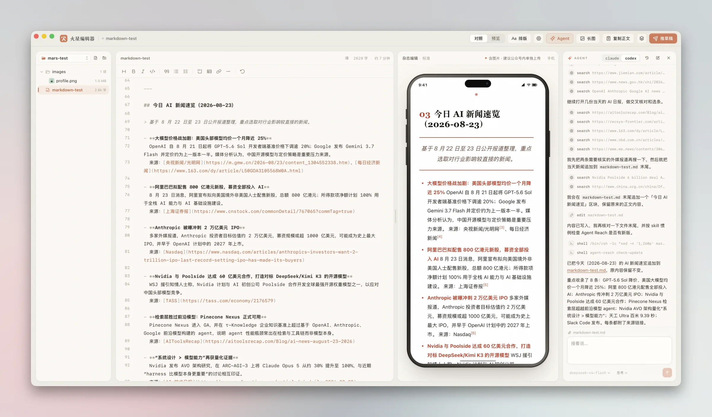

# 空核编辑器 · KonhEditor

Markdown 写作，一键转成公众号排版 —— 粘进公众号编辑器即可无损还原，也可以直接推送到公众号
草稿箱。你在预览里看到的，就是读者手机上的样子。

macOS / Windows / Linux 桌面应用。



## 0.4.0 · 个人效率中心

顶部新增任务、日历、专注、日记与标签入口，无需打开写作文件夹也可使用。
支持中英文快速添加、重复任务、子任务、优先级、日历时间块、番茄钟/秒表、后台提醒和独立浮窗。
效率数据保存在本机 SQLite；原有写作、排版与公众号发布功能保留。

账号同步及 Google 日历为可选能力，需配置自己的服务。
[完整实现与验收记录](docs/productivity-parity.md) · [同步服务部署](docs/productivity-sync-setup.md)。
目前已验证 macOS Apple Silicon 本地打包及主要本机流程，联网和其余平台实机验收范围见记录。

## 本轮更新（当前源码）

这轮围绕写作、排版和公众号草稿推送补齐了以下能力：

| 能力 | 使用入口与效果 |
| --- | --- |
| AI 排版候选 | 顶栏「AI 排版」：对照原稿与候选，确认后采用；保留原稿历史并拦截过期结果 |
| 稳定文章身份 | 应用内改名或移动后，主题、历史、草稿关联和排版候选继续跟随文章 |
| 多账号可靠推送 | 「推草稿」：按账号关联草稿、隔离素材缓存，断网后保留待核对记录并阻止重复提交 |
| 完整离线快照 | 「文章管理 → 本机完整快照」：查看提交版式、导出含图片的 HTML、按份清理 |
| 标题与素材辅助 | AI 标题候选、Agent `@` 引用素材、图片输入、个人 `/` 快捷指令及 AI 封面 |

本轮已通过 50 项前端测试、51 项 Rust 测试、前端构建及 macOS Apple Silicon 本地打包。
Windows / Linux 打包流程已加入测试检查；真实公众号操作及 Windows / Linux 实机验收仍待完成。
安装包发布状态以 [GitHub Releases](https://github.com/hackmgrm/Konh-Editor-APP/releases) 为准。
详细实现与验收范围见 [发布可靠性实施记录](docs/publishing-reliability.md)。

## 致谢与项目来源

空核编辑器基于 [whyubel1eve/Mars-Editor-APP](https://github.com/whyubel1eve/Mars-Editor-APP)
（火星编辑器）二次开发，并继续采用 MIT 协议。

首先感谢原作者完成了工作区文件管理、Markdown 排版、公众号预览、图片处理、草稿箱推送、
本地 Claude Code / Codex 集成以及 Tauri 多平台客户端等核心能力。空核编辑器是在这些扎实基础上，
面向「空核域界」内容品牌和不依赖本地终端的使用方式继续定制，不冒充原作，也不抹去上游贡献。

### 与原版火星编辑器的主要区别

| 项目 | 原版火星编辑器 | 空核编辑器 KonhEditor |
| --- | --- | --- |
| 品牌 | 火星编辑器 | 空核编辑器；预览署名为空核域界 |
| 内置主题 | 原版主题库 | 扩展为 30 套，并加入空核域界品牌版式 |
| 主题作用范围 | 一个工作区共用一个主题 | 每篇文章独立记住主题，切换文章自动恢复 |
| 品牌文章组件 | 普通 Markdown 排版 | 空核域界主题支持 front-matter 头图、导语、标签和签名卡 |
| Agent 默认方式 | 调用本机 Claude Code / Codex CLI | 仅使用可配置的 OpenAI 兼容 API Agent，不需要本地终端 |
| Agent 工作权限 | CLI 自己的工具与权限 | API Agent 仅可列出、搜索、读取和写入当前工作区文件，无 Shell 权限 |
| API 配置 | 跟随本地 CLI 配置 | 自定义 Base URL、API Key、模型名，并检测标准工具调用能力 |
| AI 改稿 | 通过完整 Agent 会话修改文件 | 可选中文字直接改写、扩写或润色，查看原文与建议后确认替换 |
| 文章管理 | 依赖磁盘文件与 Git | 内置内容状态、版本历史、逐行对比、一键恢复和发布记录 |
| 公众号账户 | 单账户配置 | 支持多个公众号账户命名、切换与独立凭据 |
| 草稿关联 | 每次手动选择新建或覆盖 | 本地文章会记住公众号草稿，后续发布自动续接更新 |
| 发布检查 | 发布时依赖人工确认 | 复制和发布前检查正文、图片、字数、标题、摘要、作者、封面及占位符等 |
| 粘贴处理 | 文本和图片基础粘贴 | 富文本自动清洗为克制的 Markdown，去除字体、颜色、脚本及编辑器冗余样式 |
| 封面 | 发布时选择一张图片 | 封面工作台支持公众号 2.35:1 头图、1:1 分享图和焦点裁切 |
| 写作体验 | 双栏与纯预览 | 增加专注模式及当前行居中的打字机模式 |
| 预览设备 | 按面板宽度自动判断，状态文字不可点击 | 右上角可手动切换手机 / 桌面并记住选择 |
| 应用外观 | 浅色 / 深色 | 默认跟随系统并实时自动切换，也可手动选择 |
| 图标 | 火星编辑器图标 | 简约“笔记页 + 空心核心 + 编辑笔划”品牌图标 |
| 更新来源 | 原作者 GitHub Releases | `hackmgrm/Konh-Editor-APP` 自有 Release、更新公钥和签名体系 |

## 工作区就是一个普通文件夹

草稿不藏在应用里面，就是磁盘上的文件：

```
工作区/
├── 随便怎么放.md    任意层级的 .md / .markdown / .txt，点开就能编辑
├── 系列/
│   └── 第一篇.md
└── images/          粘贴 / 拖入的图默认落在这里，但图放哪一层都认
```

目录结构由你自己定，应用不规定 —— 左侧文件树如实显示文件夹里的东西，新建、改名、删除、
拖拽移动都是直接落到磁盘上的真操作。

## 用 API Agent 直接改稿

在顶栏「设置 → API Agent」填写一个支持标准 Tool Calling 的 OpenAI 兼容接口：

- Base URL，例如 `https://api.openai.com/v1`
- API Key（只保存在本机应用配置目录）
- 模型名（可从接口自动获取并选择；不支持 `/models` 的服务仍可手动填写）

「测试 API」不仅检查能否聊天，还会验证接口是否返回标准 `tool_calls`。测试通过后，它就能列出、
搜索、读取、创建和修改当前工作区里的文本文件；输入框左下角可以直接切换接口返回的模型。API Agent 没有终端和 Shell
权限，绝对路径、`..` 以及任何越出工作区的路径都会被拒绝。

## 功能

- Markdown 实时预览，编辑区与预览区滚动同步
- 30 套内置主题（浅色 / 深色纸底）、三档排版密度；每篇文章可独立选择主题
- 空核域界品牌主题支持 front-matter 自动头图、导语、标签和签名卡
- OpenAI 兼容 API Agent，可直接在当前工作区读写文章，不依赖本地终端
- 深言创作：按主题、领域、结构、语气和篇幅一键生成或改写公众号文章
- 去 AI 痕迹：选区或全文分三档处理，查看差异后确认替换
- Cloudinary 图床：扫描当前文章本地图、去重上传并可选替换为永久 HTTPS 链接
- 选区 Agent：选中文字后可按自定义要求改写、扩写、缩写或润色，确认差异后再替换原文
- 文章管理：构思、写作中、待审核、待发布、已发布五种状态
- 自动版本快照，保留每篇文章最近 30 个版本，支持逐行对比和一键恢复
- AI 排版独立候选，支持原稿对照、确认采用与过期结果拦截
- 应用内改名、移动时，文章主题、历史与草稿关联保持连续
- 发布完整快照保存 HTML 与图片，可离线查看、导出及清理
- 保存公众号发布记录，并把本地文章与公众号草稿长期关联；再次发布自动更新原草稿
- 多公众号账户管理，可新增、命名、切换和删除账户
- 公众号发布前检查：缺图、超长、标题层级、占位符、外链及发布字段等问题集中提示
- 智能粘贴：将网页、Word 等富文本清洗成 Markdown，去掉外来字体、颜色和无关 HTML
- 封面工作台：支持 2.35:1 公众号头图、1:1 分享方图及水平/垂直焦点调整
- 专注模式提供稳定的单栏 Markdown 写作并隐藏文章元数据；打字机模式让当前编辑行保持在视野中央
- 编辑区可开启即时排版，在非当前行隐藏标题、强调、删除线和行内代码的 Markdown 标记
- 文件名自动跟随文章标题：空核域界主题读取 Front Matter `title`，其他主题读取首个 H1
- 编辑器界面自身有浅色 / 深色两套外观，默认跟随系统
- 公众号预览可手动切换手机 / 桌面并记住选择
- 一键复制为公众号可用的富文本
- 图片拖拽 / 粘贴上传，落到工作区 `images/`
- 代码高亮、脚注、`==高亮==` 等扩展语法
- 外链自动转文末脚注（公众号正文点不动外链）
- 复制时自动把外链图内嵌，绕开图床防盗链
- 从链接导入：任意网页转成 Markdown 草稿，图片一并落到工作区
- 一键推送到公众号草稿箱，正文图片自动上传微信素材
- 正文长图 `.png` 导出，走系统「存储到…」对话框

## v0.3 更新内容

`v0.3` 把空核编辑器从“排版工具”扩展为完整的公众号内容生产工作台：

1. **公众号发布前检查**：复制或推送前集中发现必改错误与风险提示。
2. **版本历史与修改对比**：编辑后自动快照，可查看历史和当前正文的逐行差异并恢复。
3. **发布记录及公众号草稿关联**：记录新建/更新历史，后续推送自动续接同一草稿。
4. **智能粘贴与内容清洗**：保留标题、列表、引用、链接和强调，清除网页与办公软件的冗余格式。
5. **封面工作台**：在应用里完成封面规格切换、裁切焦点调整和预览。
6. **选区 Agent 与差异确认**：只处理选中文字，模型结果必须经过确认才会替换原文。
7. **多账户和内容状态管理**：多个公众号可随时切换，文章状态覆盖从构思到已发布。
8. **打字机与专注模式**：提供更安静、长时间写作更稳定的编辑体验。

文章管理入口是顶栏的时钟图标；选区 Agent 位于 Markdown 格式工具栏最前方的星光图标；封面工作台在
「推草稿 → 选择封面」后出现。专注模式在顶栏「对照 / 预览 / 专注」中切换，旁边的准星按钮控制
打字机模式。

## 标题、素材与图片写作

- **推草稿 → AI 标题候选**：根据当前全文生成五个不超过 32 字的标题，支持补充要求、重新生成和点击回填发布标题，不修改正文。
- **Agent → @ 素材**：输入 `@` 筛选工作区文章，点击添加引用标签，最多 8 个文件。发送前保存当前修改，再读取素材最新内容；合计不超过 240 KB。
- **Agent → 图片**：可选择、粘贴或拖入 PNG、JPEG、WebP、GIF，每条最多 4 张、原图每张不超过 25 MB。图片会按现有图片处理流程压缩，并随本机对话记录保存；后续追问仍会带上最近消息的图片。当前聊天模型必须支持视觉输入和工具调用。
- **Agent → / 指令**：快速选择标题、摘要、润色和提纲提示词；“管理指令”可保存、编辑和删除个人提示词。选择后可修改，再手动发送。
- **推草稿 → AI 生成封面**：先在设置中填写独立的图片生成 Base URL、API Key 和模型名，接口需兼容 `images/generations`，返回 `data[0].b64_json` 或 HTTPS 图片 URL。生成后进入封面工作台，确认裁切后应用；取消会保留原封面。
- **文章管理 → 正式文章链接**：选择公众号并保存 `https://mp.weixin.qq.com/s/…` 链接，自动标记已发布，按账户保留关联，支持打开和移除。该链接与推草稿时的“阅读原文”字段独立。

标题生成、图片对话和封面生成由你配置的服务处理；相应正文、引用素材或图片会随请求发送给该服务。

## 发布可靠性

- 同一篇文章可分别关联多个公众号草稿，切换账号后继续更新对应草稿；旧数据会从本地历史尽可能恢复关联。
- 正文和封面素材缓存按 AppID 隔离。自动续接草稿时先读取微信现有封面和摘要，读取失败时不会直接覆盖。
- 推送时固定正文、图片和发布字段，提交前检查文章及目标账户是否变化。推送期间不能修改发布表单。
- 推送记录先写入本机，再提交微信请求。提交后断网会标记“结果待核对”，重开应用仍会阻止重复推送。
- “推草稿”和“文章管理”都能查看推送记录及原文快照。结果不确定时先核对公众号草稿箱，再点击“已核对，解除拦截”；若草稿已经存在，应选择更新已有草稿。
- 最近 50 次普通推送记录与所有待核对记录保存在本机应用配置中，不包含 AppSecret 或 access_token。
- 新推送会在独立的 `article-assets` 数据目录保存正文 HTML、原文和图片文件，成功保存后才发送草稿。文章管理中的“本机完整快照”支持离线预览、导出含图片的 HTML，以及按份清理；待核对的推送和当前采用的排版受到保护。旧版文字记录不会自动补出图片快照。

开发验证：`npm run test:publishing`。本轮实施范围与后续规划见 [发布可靠性实施记录](docs/publishing-reliability.md)。

## AI 排版候选与文章身份

顶栏新增“AI 排版”：填写排版要求后，使用已配置的 API Agent 生成独立候选。原稿与候选左右预览，可展开 Markdown 文字对照，检查后点击“采用此排版”。采用前原稿会保留到版本历史，候选、原稿及预览图片也保存在独立快照目录；重开应用可继续查看历史候选。

生成期间更改原文或排版设置、关闭后重新发起请求时，旧结果不会替换新候选。采用前会再次检查原文、图片和版式是否变化；模型仍可能改动表述，请在对照中核对事实。此功能会将正文和排版要求发送到你配置的 API 服务。

文章在本机获得稳定标识。应用内自动改名、手动改名、移动文件夹后，主题、历史、多公众号草稿、待核对记录与排版候选继续关联同一篇文章。新建同名文章使用新标识。应用内路径变更先记录意图，中断后重新打开工作区可恢复；从应用外移动文件目前不会猜测新旧文件的对应关系。

## 从链接导入

网址复制好，点左侧文件树顶上的地球图标（或者在文件夹上右键「从链接导入」），链接已经替你填好了 ——
剪贴板里是网址就自动带进来，不用再粘一次，直接回车。

出来的是一篇 Markdown 草稿：只要正文，导航栏、侧边栏、推荐位、评论区都不跟着进来。默认「把图片
一并存进工作区」—— 图落到 `images/` 就成了本地文件，之后复制、导长图、推草稿都不用再看对方图床
的脸色。

**公众号文章走本地**：`mp.weixin.qq.com` 的链接由这台电脑直接去微信取，网址不发给任何人。
公众号对第三方抓取服务一律弹「环境异常」验证页，所以这类链接本来也只能这么走；好在正文容器
（`#js_content`）是固定的，不需要猜哪块是正文。

**其他网页走 Jina Reader**：正文提取交给 `r.jina.ai` —— 判断整个 DOM 里哪一块是正文，还要能跑
JavaScript 渲染的页面，这两件事塞不进一个桌面编辑器。代价说明白：**你要导入的网址会发给它**，
其它什么都不会（凭据、草稿、工作区都不经过），图片仍是这台电脑直接从原站拉的。不注册就能用，
每分钟 20 次；不够的话在设置里填一个免费 key，能提到每分钟 500 次。

登录墙、付费墙后面的页面抓不到，会直接告诉你抓不到，而不是给你一篇残缺的草稿。

## 公众号推送

直连微信接口，请求由 Rust 侧发出：AppSecret 从本机直接到微信，中间不经过任何第三方。
出口 IP 就是你这条宽带，白名单填一次一直有效。

AppID / AppSecret 填在顶栏齿轮「设置」里，下面跟着「IP 白名单」一步 —— 这一步不能跳过：
出口 IP 不在白名单里，微信一律返回 40164，凭据填得再对也调不通。按「获取出口 IP」拿到本机
出口地址，粘进公众号后台保存，再用底栏的「测试连接」验一遍。

## 开发

```bash
npm install
npm run app        # 开发模式，起 Tauri 窗口
npm run app:build  # 打包，产物在 src-tauri/target/release/bundle/
                   # macOS 出 .app / .dmg，Windows 出 NSIS 安装包，Linux 出 .deb / .rpm / .AppImage
                   # 带 --no-sign：本地打包不做签名
npm run build      # 只做前端类型检查 + 构建
npm run test:preflight      # 公众号发布前检查测试
npm run test:writing        # 快捷指令与素材输入解析测试
npm run test:content-state  # 版本、发布记录及草稿关联测试
npm run test:publishing     # 发布日志、素材缓存、文章身份与排版候选测试
```

Rust 侧的测试覆盖工作区操作、路径边界、图片处理、AI 排版响应解析和完整快照存储：

```bash
cd src-tauri && cargo test
```

工具链由 `src-tauri/rust-toolchain.toml` pin 在 1.95 —— 依赖树里有 crate 用 edition2024。

### 同步原作者更新

本仓库是长期维护的 fork。建议把原作者仓库固定为 `upstream`，自己的仓库继续使用 `origin`：

```bash
git remote add upstream https://github.com/whyubel1eve/Mars-Editor-APP.git
git fetch upstream
git switch main
git merge upstream/main
```

首次添加后，后续只需执行 `git fetch upstream` 和 `git merge upstream/main`。合并前先新建分支并完成备份，
解决冲突后至少运行 `npm run build` 与 `cd src-tauri && cargo test`，再分别检查 macOS、Windows 的打包任务。

同步上游时需要重点保留的空核定制边界：

- 品牌、图标、应用标识及自有更新渠道：`src-tauri/tauri.conf.json`、`src-tauri/icons/`、更新配置。
- 主题库、空核域界品牌版式及每篇文章独立主题：主题定义、`src/App.tsx`、vault 偏好结构。
- 纯 API Agent：`src-tauri/src/agent_api.rs`、`src/components/AgentPanel.tsx`、`SettingsDialog.tsx`。
- 选区 Agent、智能粘贴与写作模式：`EditorPane.tsx`、`src/smartPaste.ts`、`Toolbar.tsx`。
- 文章状态、版本、发布记录和草稿关联：`src/store/contentState.ts`、`ArticleCenterDialog.tsx`、`PublishDialog.tsx`。
- 稳定文章身份与路径恢复：`src/articleIdentity.ts`、`src/store/articleIdentity.ts`、`src/store/useVault.ts`。
- AI 排版候选和离线资产：`LayoutDialog.tsx`、`src/layoutResults.ts`、`src/artifacts.ts`、`src-tauri/src/artifacts.rs`。
- 发布日志与素材隔离：`src/publishJournal.ts`、`src/store/publishJournal.ts`、`src/uploadCache.ts`。
- 多公众号账户：`src/store/wechatConfig.ts` 和 `SettingsDialog.tsx`。
- 发布前检查与封面工作台：`src/preflight.ts`、`PreflightDialog.tsx`、`CoverWorkbench.tsx`。
- 手动切换预览设备与跟随系统夜间模式：`PreviewPane.tsx` 和对应样式、偏好设置。
- 发布签名：只使用本仓库自己的 Tauri 公钥和 GitHub Secrets；私钥与密码绝不能提交到 Git。

如果上游再次修改同一区域，优先保留其缺陷修复和通用能力，再把上述定制行为重新适配进去。每次同步后把
上游版本、冲突处理和保留的定制功能写入 `CHANGELOG.md`，这样后续维护者可以追溯来源。

## 技术栈

Tauri 2 · Rust · React 19 · TypeScript · Vite 7 · CodeMirror 6 · markdown-it · highlight.js

## 协议

MIT

“深言创作”的分类与文章结构工作流改编自 [honwhy/DeepTalk](https://github.com/honwhy/DeepTalk)（ISC）。
